###3D PRINTED PARTS CHECKLIST

**image** | **Part Number** | **Quantity** | **Print Settings**
--------- | --------------- | ------------ | ------------------
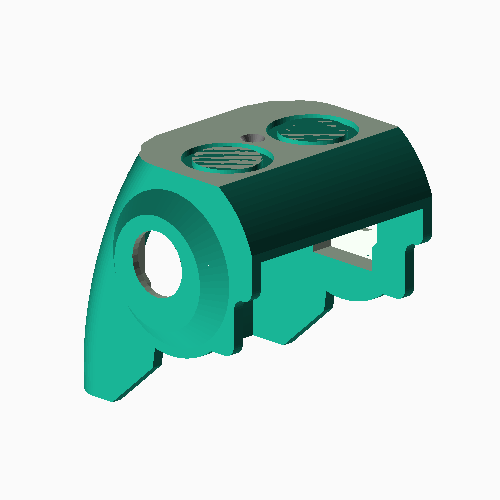 | Citro5\_40 | 1 |  **Layers:** 0.2mm    **Infill:** 30%    **Supports:** No
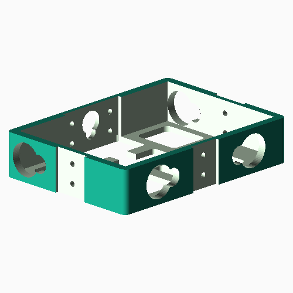 | Citro6\_20 | 1 |  **Layers:** 0.2mm    **Infill:** 30%    **Supports:** No
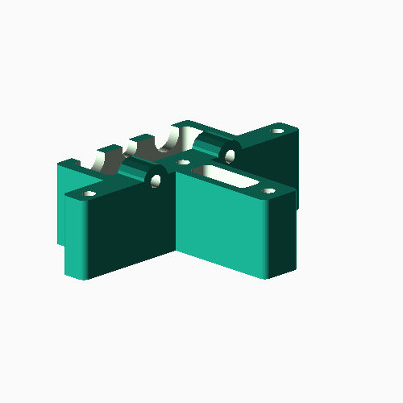 | Citro6\_21 | 1 |  **Layers:** 0.2mm    **Infill:** 30%    **Supports:** No
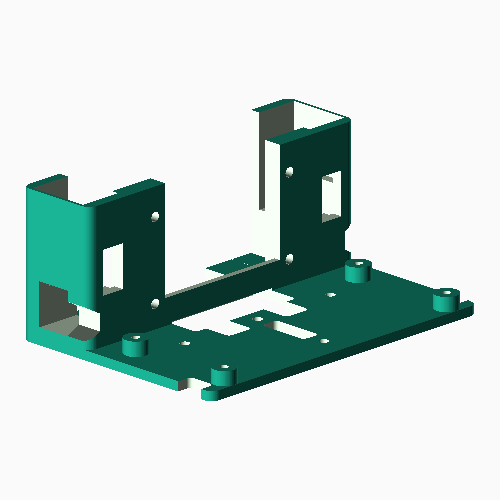 | Citro6\_22 | 1 |  **Layers:** 0.2mm    **Infill:** 30%    **Supports:** No
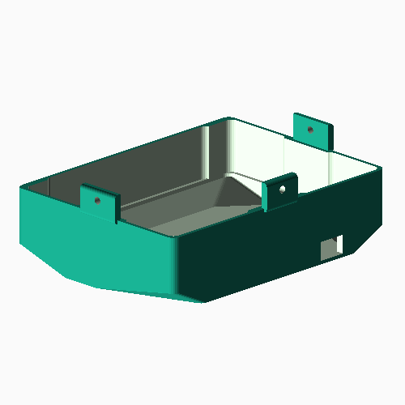 | Citro6\_23 | 1 |  **Layers:** 0.2mm    **Infill:** 30%    **Supports:** No
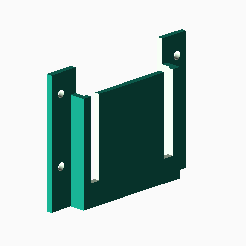 | Citro6\_25 | 1 |  **Layers:** 0.2mm    **Infill:** 30%    **Supports:** No
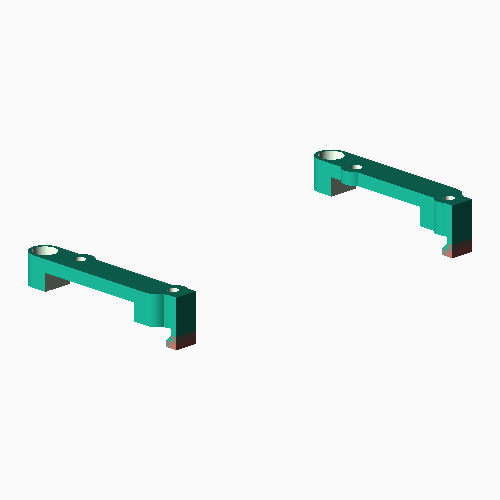 | Citro6\_27 | 1 |  **Layers:** 0.2mm    **Infill:** 30%    **Supports:** No
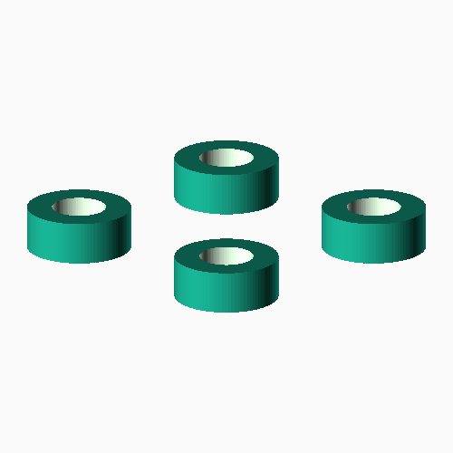 | Citro6\_29 | 1 |  **Layers:** 0.2mm    **Infill:** 30%    **Supports:** No
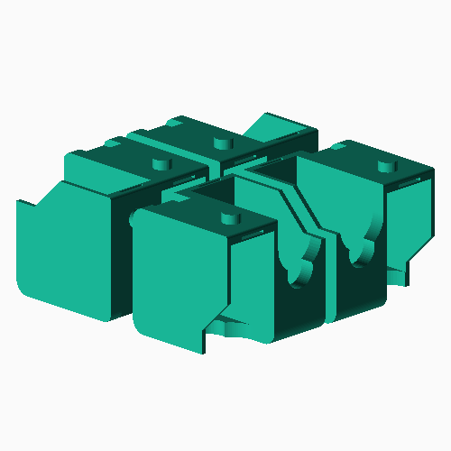 | Citro6\_40 | 1 |  **Layers:** 0.2mm    **Infill:** 30%    **Supports:** No
 | Citro6\_50 | 1 |  **Layers:** 0.2mm    **Infill:** 30%    **Supports:** No
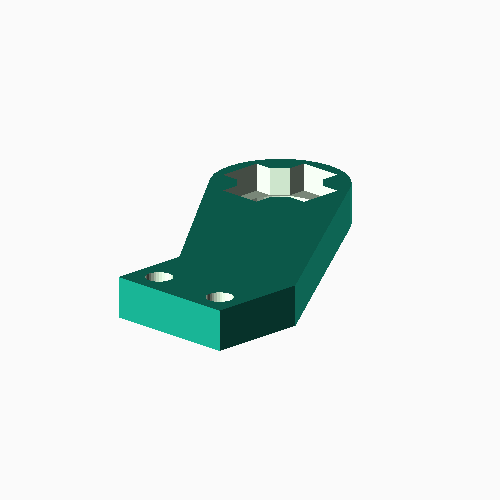 | Citro6\_51 | 1 |  **Layers:** 0.2mm    **Infill:** 30%    **Supports:** No
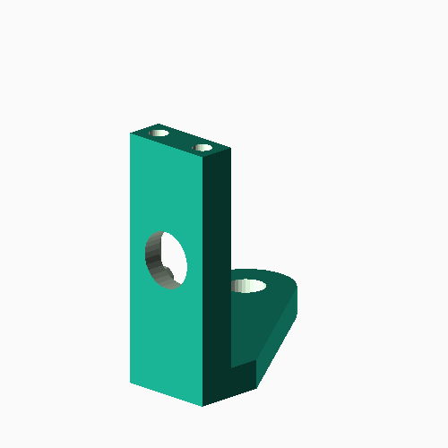 | Citro6\_52 | 1 |  **Layers:** 0.2mm    **Infill:** 30%    **Supports:** No
-----