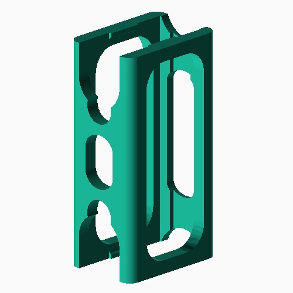
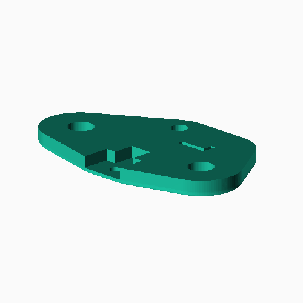
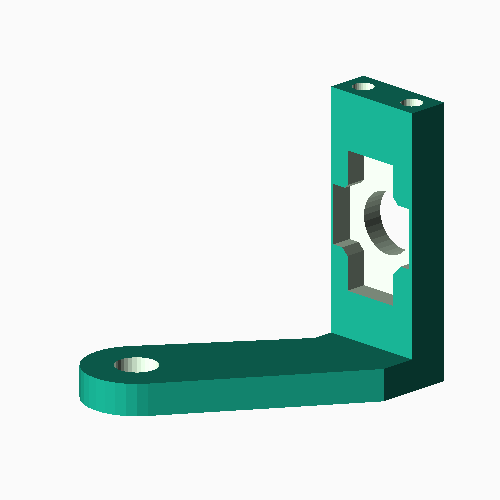
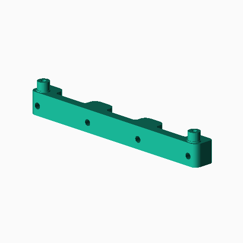

###3D PRINTED PARTS CHECKLIST

**image** | **Part Number** | **Quantity** | **Print Settings**
--------- | --------------- | ------------ | ------------------
 | Citro6\_11 | 4 |  **Layers:** 0.2mm    **Infill:** 30%    **Supports:** No    **Cooling:** Enabled
 | Citro6\_12A | 3 |  **Layers:** 0.2mm    **Infill:** 30%    **Supports:** No    **Cooling:** Enabled
 | Citro6\_12B | 3 |  **Layers:** 0.2mm    **Infill:** 30%    **Supports:** No    **Cooling:** Enabled
 | Citro6\_13A | 2 |  **Layers:** 0.2mm    **Infill:** 30%    **Supports:** No    **Cooling:** Enabled
 | Citro6\_13B | 2 |  **Layers:** 0.2mm    **Infill:** 30%    **Supports:** No    **Cooling:** Enabled
 | Citro6\_20 | 1 |  **Layers:** 0.2mm    **Infill:** 30%    **Supports:** No    **Cooling:** Enabled
 | Citro6\_21 | 1 |  **Layers:** 0.2mm    **Infill:** 30%    **Supports:** No    **Cooling:** Enabled
 | Citro6\_22 | 1 |  **Layers:** 0.2mm    **Infill:** 30%    **Supports:** No    **Cooling:** Enabled
 | Citro6\_23 | 1 |  **Layers:** 0.2mm    **Infill:** 30%    **Supports:** No    **Cooling:** Disabled
 | Citro6\_25 | 1 |  **Layers:** 0.2mm    **Infill:** 30%    **Supports:** No    **Cooling:** Enabled    **Brim:** Yes
 | Citro6\_26 | 1 |  **Layers:** 0.2mm    **Infill:** 30%    **Supports:** No    **Cooling:** Enabled
 | Citro6\_27 | 4 |  **Layers:** 0.2mm    **Infill:** 30%    **Supports:** No    **Cooling:** Enabled
 | Citro6\_30 | 2 |  **Layers:** 0.2mm    **Infill:** 30%    **Supports:** No    **Cooling:** Enabled
 | Citro6\_31L | 1 |  **Layers:** 0.2mm    **Infill:** 30%    **Supports:** No    **Cooling:** Enabled
 | Citro6\_31R | 1 |  **Layers:** 0.2mm    **Infill:** 30%    **Supports:** No    **Cooling:** Enabled
 | Citro6\_40A | 1 |  **Layers:** 0.2mm    **Infill:** 30%    **Supports:** No    **Cooling:** Enabled
 | Citro6\_40B | 1 |  **Layers:** 0.2mm    **Infill:** 30%    **Supports:** No    **Cooling:** Enabled
 | Citro6\_40C | 1 |  **Layers:** 0.2mm    **Infill:** 30%    **Supports:** No    **Cooling:** Enabled
 | Citro6\_40D | 1 |  **Layers:** 0.2mm    **Infill:** 30%    **Supports:** No    **Cooling:** Enabled
 | Citro6\_41L | 1 |  **Layers:** 0.2mm    **Infill:** 30%    **Supports:** No    **Cooling:** Enabled
 | Citro6\_41R | 1 |  **Layers:** 0.2mm    **Infill:** 30%    **Supports:** No    **Cooling:** Enabled
 | Citro6\_42 | 2 |  **Layers:** 0.2mm    **Infill:** 30%    **Supports:** No    **Cooling:** Enabled
 | Citro6\_43L | 1 |  **Layers:** 0.2mm    **Infill:** 30%    **Supports:** No    **Cooling:** Enabled
 | Citro6\_43R | 1 |  **Layers:** 0.2mm    **Infill:** 30%    **Supports:** No    **Cooling:** Enabled
 | Citro6\_44L | 1 |  **Layers:** 0.2mm    **Infill:** 30%    **Supports:** No    **Cooling:** Enabled
 | Citro6\_44R | 1 |  **Layers:** 0.2mm    **Infill:** 30%    **Supports:** No    **Cooling:** Enabled
 | Citro6\_45L | 1 |  **Layers:** 0.2mm    **Infill:** 30%    **Supports:** No    **Cooling:** Enabled
 | Citro6\_45R | 1 |  **Layers:** 0.2mm    **Infill:** 30%    **Supports:** No    **Cooling:** Enabled
 | Citro6\_50 | 1 |  **Layers:** 0.2mm    **Infill:** 30%    **Supports:** No    **Cooling:** Enabled 
 | Citro6\_51 | 1 |  **Layers:** 0.2mm    **Infill:** 30%    **Supports:** No    **Cooling:** Enabled
 | Citro6\_52 | 1 |  **Layers:** 0.2mm    **Infill:** 30%    **Supports:** No    **Cooling:** Enabled
 | Citro6\_53 | 1 |  **Layers:** 0.2mm    **Infill:** 30%    **Supports:** No    **Cooling:** Enabled
 | Citro6\_60 | 1 |  **Layers:** 0.2mm    **Infill:** 30%    **Supports:** No    **Cooling:** Enabled
 | Citro6\_61L | 1 |  **Layers:** 0.2mm    **Infill:** 30%    **Supports:** No    **Cooling:** Enabled
 | Citro6\_61R | 1 |  **Layers:** 0.2mm    **Infill:** 30%    **Supports:** No    **Cooling:** Enabled
 | Citro6\_70 | 1 |  **Layers:** 0.2mm    **Infill:** 30%    **Supports:** No    **Cooling:** Enabled
-----